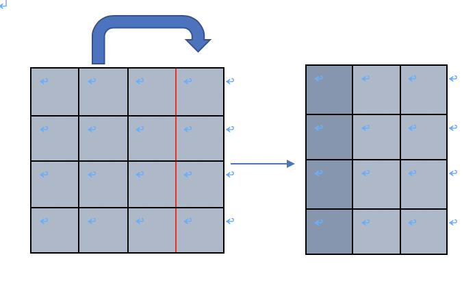

# 問題
折り紙  
URL:https://onlinejudge.u-aizu.ac.jp/challenges/sources/ICPC/Prelim/1625

### 問題概要
縦m、横nの折り紙があります。はじめに、この折り紙を指示に従って折ります。次に、その折り紙に針を刺した時に、何枚の紙に貫通するかをそれぞれ出力してください。（大まかな題意）

---

# 解法
ひたすら添字に気をつけながら、シミュレーションをする問題です。配列の操作を理解しているかを試される問題です。  
多分解法は人によって微妙に違っていて、十人十色の解答が生まれると思いますが、個人的な見解を紹介します。  

この問題の難しいところは
* 紙が何枚重なっているかという情報の持ち方
* 折る操作の実装
* (折り紙上での)原点が動的に変わる

この辺りだと思います。

### 紙の重なり情報の持ち方と初期化
折り紙のサイズと同じサイズの２次元配列を用意して、その要素が折り紙の各マスにおける枚数を意味する、と考えます。  
しかし、何も考えずにやると以下のような場合にうまくいきません。  

このような場合には、仮に折り紙と同じサイズの配列を確保していても、右側に大きくはみ出すので配列外参照になります。  
これを回避するために、大きめに1000*1000くらいの配列を確保しておきましょう。また、はじめは何もない空間という意味で、0で初期化します。
~~~
vector<vector<int> >  v(1000,vector<int>(1000,0));  //1000*1000の配列を0で初期化
~~~

次に、この空間に折り紙を置きましょう。先程説明したように、折る操作にははみ出す危険性がありますが、折り方の定義から上、または右にはみ出すしかありません。よって、折り紙は空間の左下に沿うように置きます。この置く操作は、用意した配列の左下に沿うように`1`を入れる操作と等しいです。
~~~
for(int i=0;i<h;i++){
    for(int j=0;j<w;j++){
        v[1000-i-1][j]=1;
    }
}
~~~
以上により、現在の配列の状態は下のようになります
~~~
000......000
000......000
11..1100..00
11..1100..00
..........
11..1100..00
~~~
もうちょっと具体的に言うと、例えば`n=4 m=3`の折り紙を置いてみれば
~~~
00....00
00....00
........
11110..0
11110..0
11110..0
~~~
となります。

### 折るという操作
折る操作は、どこのマス目がどこのマス目と重なるか、に注目すれば良いです。この時、横に折るにしろ縦に折るにしろ、ある基準座標cが存在して、`(c-1,c),(c-2,c+1),(c-3,c+2)...(c-x-1,c+x)`が重なることが分かります。ここでのcは、x座標でもy座標でも、どっちとも思っていただいて大丈夫です。  

もう少し具体的に、単なる数直線を折ることを考えます。  
いま、[1,2,3,4,5,6]という数直線があって、c=3であるとします。つまり、折る基準が3と4の間にあります。  
この時は、**値で言えば**{(3,4),(2,5),(1,6)} の組みがそれぞれ合わさります。また、**添字で言えば**{(2,3),(1,4),(0,5)}がそれぞれ合わさります。

さて、先の数直線の話というのは、d=1で横向きに折る操作そのものだと考えることができます。数直線というのは１次元配列なので、これを２次元配列に拡張したものを考えれば良いです。

対して、縦向きのときは少しめんどくさいです。原因は対象とする原点の違いにあって、折り紙上における原点は（数学みたいな）**左下**で、プログラムにおける原点は(processingみたいな)**左上**にあることにあります。

というわけで、原点自体も自分で作ってしまいます。

### (折り紙上での)原点
折り紙を折る時や、最後に穴を開けていくときでも、座標の指定というものが存在します。ですが、この座標の指定はどこを原点としているかというと、**その時点での折り紙の左下の位置**になっています。折り紙は折られることで左の辺がどんどん右に動いていったり、下の辺がどんどん上に動きます。つまり、原点の位置も動的に変わっていくということです。

ここで、1000*1000の配列を用意したことを思い出すと、最初の原点(x0,y0)は(0,999)であることは分かります。折られる過程で、この原点はどう計算し直すでしょうか。
実は、これはcの値を足し引きするだけで済みます。d=1で横に折るとき、x0はx0+cになります。また、d=2で縦に折るとき、y0はy0-cになります。実際に折る操作と原点の動きを想像してみてください。

### 実装
では徐々に実装をしていきます。dの値がどんなであれ、基本的な流れはこうです。
* cの値と原点(x0,y0)の値を用いて、折る基準座標を求める
* その基準座標から左右に(上下に)広げるようにして重ねていく（値を足していく）
* 原点(x0,y0)の位置を更新する

横に折るときは、以下みたいなコードを書けます。
~~~
if(d==1){
    int idx=x0+c; //idxが基準座標。原点からcだけ右のx座標
    for(int j=0;j<y0+1;j++){
        for(int k=0;k<c;k++){
            v[j][idx+k]+=v[j][idx-k-1]; //左右に広げるように足す
        }
    }
    x0=x0+c; //原点のx座標を更新
}
~~~
特に、`v[j][idx+k]+=v[j][idx-k-1]; `に注目します。先程「折るという操作」という項目で`(c-1,c),(c-2,c+1),(c-3,c+2)...(c-x-1,c+x)`という表記をしましたが、ここでの配列の2つめの添字の組は、まさにこれと一致しています。

また、右側に向けて折るので、値が増えるのは常に右側の要素です。

次に縦に折る時は、以下みたいなコードを書けます。
~~~
if(d==2){ //縦向きに折る
    int idx=y0-c; //idxが基準点。原点からcだけ上のy座標
    for(int j=x0;j<1000;j++){
        for(int k=0;k<c;k++){
            v[idx-k][j]+=v[idx+k+1][j]; //上下に広げるように足す
        }
    }
    y0=y0-c; //原点のy座標を更新
}
~~~
縦に折る時は下から上に折るので、y座標が小さい方に足しこんでいけば良いです。

### 穴を開ける
最後に穴を開けますが、折る段階で更新した原点(x0,y0)が使えます。
穴を開ける座標は、入力として受けたx,yを使って`(x0+x,y0-y)`と書けるので、配列のこの要素を出力して終了です。

### 配列サイズを大きめに取るとはいえ、なぜ1000*1000にしたのか
別に僕が知っていたからではありません。ただ、折り紙のサイズは最大で32なので、仮に、常に最大限にはみ出すように折っていくとしても(32+31+...+2+1)=528?くらいにしかならないので、550程度確保すれば大丈夫です。でも550って中途半端なので、とりあえず1000で良いんじゃないの、という気持ちです。  
もう一つの理由としては、今回のアルゴリズムの計算量はO(n2)です。これに対する現実的なnは1000程度なので、じゃあ1000でいっかーという感覚でした。

### 付録：配列上の数字の動き
サンプルの最後のデータセットを元に、折り紙が折られる様子を示します。以下の様子は簡易版なので、上記プログラムで扱った配列の中身とは結構異なるので、注意してください。

* データセット
~~~
3 3 3 2
1 2
2 1
1 1
0 1
0 0
~~~

初期化
~~~
000000
000000
000000
111000
111000
111000
~~~
d=1,c=2
~~~
000000
000000
000000
002100
002100
002100
~~~
d=2,c=1
~~~
000000
000000
000000
002100
004200
000000
~~~
d=1,c=1
~~~
000000
000000
000000
000300
000600
000000
~~~

最終的な折り紙は
~~~
3
6
~~~
になり、  
x=0,y=0に穴を開ければ6  
x=0,y=1に穴を開ければ3  
がそれぞれ得られます。

(--今回の解法はあくまで一例です--)

